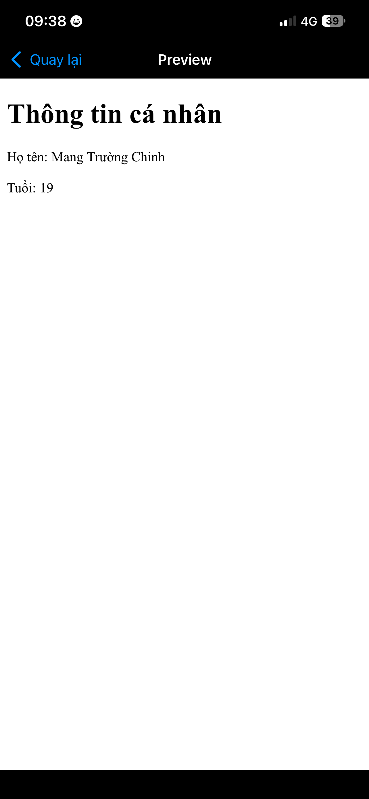
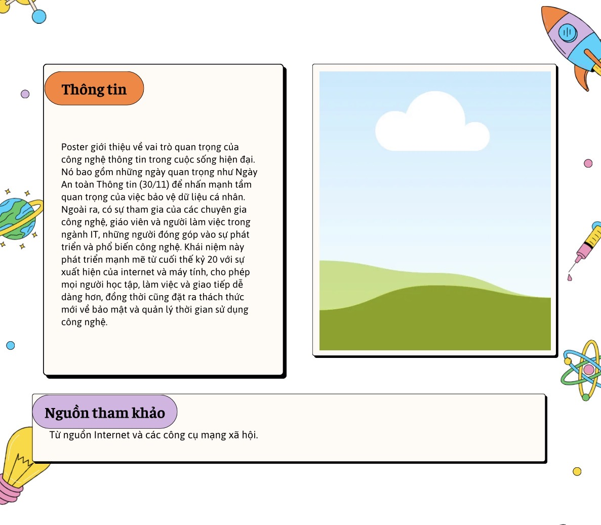

# Website-c-nh-n-HTML
# 1. Mô tả chức năng website cá nhân

chào bạn đây là Website cá nhân của tôi nếu bạn có thác mắt hay có vấn đề gì về bài viết này của tôi thì xin hay chỉ giáo thêm cho tôi vì đây là lần đầu tôi được tiếp xúc với trang wed này.

Website giúp người dùng:
- Xem thông tin cá nhân
- Biết sở thích cá nhân
- Liên hệ với chủ website

Các trang trong website được liên kết với nhau bằng menu điều hướng.

---

# Mô tả nội dung các trang

## Trang chủ - index.html

Trang chủ website cá nhân của tôi mới lập nên chưa có các thông tin chủ đạo nào cả 

Nội dung gồm:
- Tiêu đề website
- Menu chuyển trang
- Nội dung giới thiệu vì làm bài nộp cho thầy tôi cx chỉ hiểu sơ về wed
- này thôi

---

## Trang thông tin - thongtin.html

Trang này dùng để hiển thị thông tin cá nhân.

Nội dung gồm:
- Họ tên mang trường chinh
- Ngành học CDCNTT19
- Quê quán khánh hoà

---

## Trang sở thích - sothich.html

Trang này dùng để giới thiệu sở thích cá nhân.

Nội dung gồm:
- Nghe nhạc
- Chơi game
- Xem phim

---

## Trang liên hệ - lienhe.html

Trang này dùng để cung cấp thông tin liên hệ.

Nội dung gồm:
- Email:chinhsiro2007@gmail.com
- Số điện thoại:0935749943

---

# 2. Công cụ thiết kế

Các công cụ sử dụng để thiết kế website:

- GitHub
- HTML
- CSS
- Safari

## Hình ảnh GitHub Pages

## Hình ảnh website

